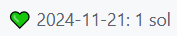
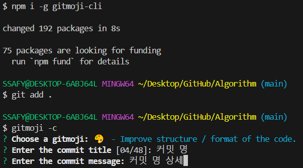
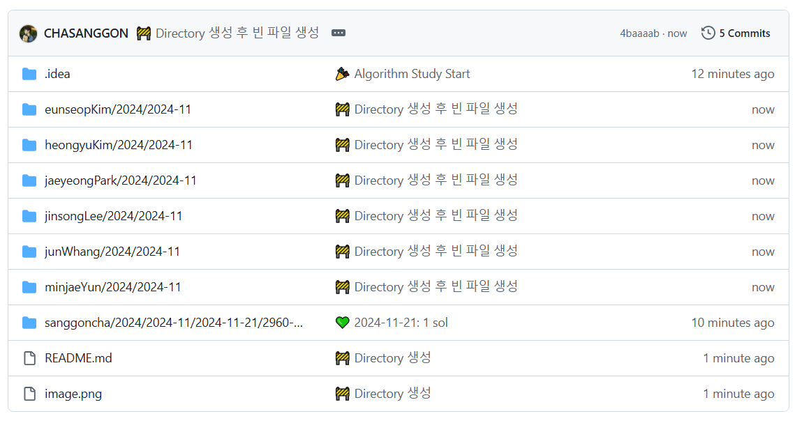

<!-- Attendance Section -->
# 📅Attendance Check

⏲ **2025-02-25 23:44:10** 출석현황 📝 마지막 커밋 작성자: **GloryMJ**
|   | Thu | Fri | **Sat** | **Sun** | Mon | Tue | Wed | Thu | Fri | **Sat** | **Sun** | Mon | Tue |
| --- | --- | --- | --- | --- | --- | --- | --- | --- | --- | --- | --- | --- | --- |
| sanggonCha | 🟩 | 🟩 | 🟩 | ⬜ | 🟩 | 🟩 | 🟩 | 🟩 | 🟩 | 🟩 | 🟩 | 🟩 | 🟩 |
| heongyuKim | 🟩 | 🟩 | 🟩 | 🟩 | ⬜ | 🟩 | ⬜ | ⬜ | ⬜ | ⬜ | ⬜ | ⬜ | 🟩 |
| jaeyeongPark | 🟩 | 🟩 | ⬜ | ⬜ | 🟩 | 🟩 | 🟩 | ⬜ | ⬜ | ⬜ | ⬜ | 🟩 | 🟩 |
| minjaeYoon | 🟩 | 🟩 | 🟩 | 🟩 | 🟩 | 🟩 | 🟩 | 🟩 | 🟩 | 🟩 | 🟩 | 🟩 | 🟩 |
| minsooKim | 🟩 | 🟩 | 🟩 | 🟩 | 🟩 | 🟩 | 🟩 | 🟩 | 🟩 | 🟩 | 🟩 | 🟩 | 🟩 |
| eunseopKim | ⬜ | 🟩 | ⬜ | ⬜ | 🟩 | 🟩 | 🟩 | 🟩 | 🟩 | ⬜ | ⬜ | 🟩 | ⬜ |
| yunhaKwon | 🟩 | 🟩 | 🟩 | 🟩 | 🟩 | 🟩 | 🟩 | 🟩 | 🟩 | ⬜ | 🟩 | 🟩 | 🟩 |

<!-- Rules Section -->
# 🏳‍🌈Rule
1. 평일에는 하루 1솔 이상하고 커밋하기 / 주말에는 자유
2. 커밋 메세지: 이모지(깃모지를 사용) +  `2024-11-21: 1 sol`

    

## 🌏gitmoji 사용 방법
### 설치 방법
`npm i -g gitmoji-cli`

### 사용 방법
1. `git add .`
2. `gitmoji -c` (달라진 부분: git commit -m "message" 대신)
3. `git push`

### 코드 예시

### 적용 예시

