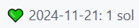
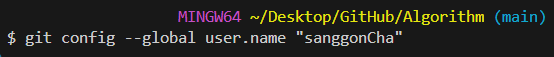
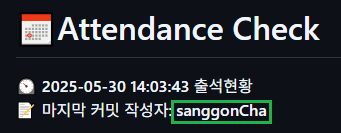
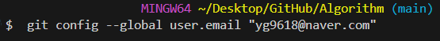
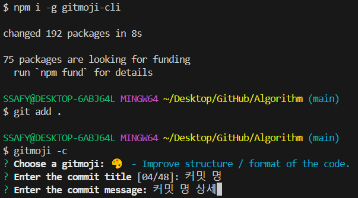
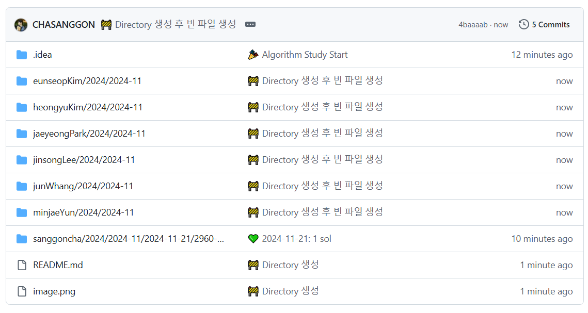
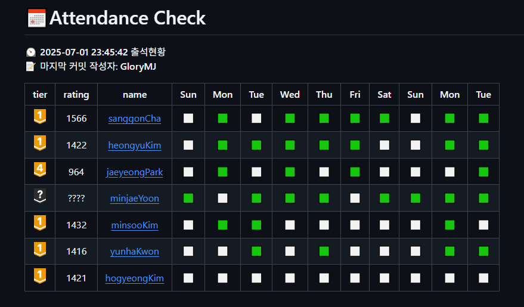

<!-- Attendance Section -->
# 📅Attendance Check

⏲ **2026-04-25 17:25:25** 출석현황 📝 마지막 커밋 작성자: **sanggonCha**
| tier | rating | name | Thu | Fri | **Sat** | **Sun** | Mon | Tue | Wed | Thu | Fri | **Sat** |
| :---: | :---: | :---: | :---: | :---: | :---: | :---: | :---: | :---: | :---: | :---: | :---: | :---: |
|  | ????  | [sanggonCha](https://solved.ac/profile/yg9618) | ⬜ | ⬜ | 🟩 | ⬜ | ⬜ | ⬜ | ⬜ | ⬜ | ⬜ | 🟩 |
|  | ????  | [heongyuKim](https://solved.ac/profile/khg6436) | ⬜ | ⬜ | ⬜ | ⬜ | ⬜ | ⬜ | ⬜ | ⬜ | ⬜ | ⬜ |
|  | ????  | [jaeyeongPark](https://solved.ac/profile/pjy980526) | ⬜ | ⬜ | ⬜ | ⬜ | ⬜ | ⬜ | ⬜ | ⬜ | ⬜ | ⬜ |
|  | ????  | [minjaeYoon]( ) | ⬜ | ⬜ | ⬜ | ⬜ | ⬜ | ⬜ | ⬜ | ⬜ | ⬜ | ⬜ |
|  | ????  | [hogyeongKim](https://solved.ac/profile/rlaghtl2) | ⬜ | ⬜ | ⬜ | ⬜ | ⬜ | ⬜ | ⬜ | ⬜ | ⬜ | ⬜ |

<!-- Rules Section -->
# 🏳‍🌈 Rule
1. 평일에는 하루 1솔 이상하고 커밋하기 / 주말에는 자유
2. 커밋 메세지: 이모지(깃모지를 사용) +  `2024-11-21: 1 sol`

    

# ⚙ 세팅
1. 커밋 `name` 설정: `git config --global user.name "yourname"`

    

    

2. 커밋 `email` 설정: ` git config --global user.email "your.email@example.com"`

    

    설정한 메일을 기준으로 `Commit` 분석

# 🌏 gitmoji 사용 방법
## 설치 방법
`npm i -g gitmoji-cli`

## 사용 방법
1. `git add .`
2. `gitmoji -c` (달라진 부분: git commit -m "message" 대신)
3. `git push`

### 코드 예시

### 적용 예시

# 😮 GitHub Action 으로 출석부 자동 반영!

